# 🔄 Flowchart Aplikasi POS Frontend

---

## 📋 Daftar Isi

- [🔄 Flowchart Aplikasi POS Frontend](#-flowchart-aplikasi-pos-frontend)
  - [📋 Daftar Isi](#-daftar-isi)
  - [1. Flow Utama Aplikasi](#1-flow-utama-aplikasi)
  - [2. Flow Autentikasi](#2-flow-autentikasi)
    - [2.1 Flow Login](#21-flow-login)
    - [2.2 Flow Register](#22-flow-register)
    - [2.3 Flow Reset Password (2 Step)](#23-flow-reset-password-2-step)
  - [3. Flow Dashboard Kasir](#3-flow-dashboard-kasir)
    - [3.1 Komponen Dashboard Kasir](#31-komponen-dashboard-kasir)
  - [4. Flow Dashboard Admin](#4-flow-dashboard-admin)
    - [4.1 Komponen Dashboard Admin](#41-komponen-dashboard-admin)
  - [5. Flow ProtectedRoute](#5-flow-protectedroute)
  - [6. Flow AuthContext](#6-flow-authcontext)
  - [7. Flow Lengkap dari Awal sampai Akhir](#7-flow-lengkap-dari-awal-sampai-akhir)
  - [8. Flow Sales Report (Cashier \& Admin)](#8-flow-sales-report-cashier--admin)
  - [9. Flow Settings (Cashier \& Admin)](#9-flow-settings-cashier--admin)
    - [9.1 Cashier Settings](#91-cashier-settings)
    - [9.2 Admin Settings](#92-admin-settings)
  - [10. Flow Logout](#10-flow-logout)
  - [11. Flow Error Handling Global](#11-flow-error-handling-global)
    - [11.1 404 Not Found](#111-404-not-found)
    - [11.2 Unauthorized Access](#112-unauthorized-access)
    - [11.3 Token Expired Saat Sudah Login](#113-token-expired-saat-sudah-login)
    - [11.4 Network Error](#114-network-error)
  - [12. 🗺️ Peta Interaksi User per Halaman](#12-️-peta-interaksi-user-per-halaman)
    - [👤 Kasir (Cashier)](#-kasir-cashier)
    - [👨‍💼 Admin](#-admin)
  - [13. 🔐 State Management Flow](#13--state-management-flow)
  - [14. 📊 Komponen Hierarki Lengkap](#14--komponen-hierarki-lengkap)
    - [Cashier Layout Components](#cashier-layout-components)
    - [Admin Layout Components](#admin-layout-components)
  - [🚀 Tips Membaca Flowchart](#-tips-membaca-flowchart)

---

## 1. Flow Utama Aplikasi

```mermaid
flowchart TD
    A[Aplikasi Dibuka] --> B[main.jsx Entry Point]
    B --> C[AuthProvider Wrapper]
    C --> D[BrowserRouter]
    D --> E[Routes Configuration di App.jsx]
    E --> F{Cek URL Path}

    F -->|/| G[SplashScreen]
    F -->|/login| H[AuthLayout > LoginPage]
    F -->|/register| I[AuthLayout > RegisPage]
    F -->|/reset-password| J[AuthLayout > ResetPassPage]
    F -->|/dashboard/*| K[ProtectedRoute > CashierLayout]
    F -->|/admin/*| L[ProtectedRoute > AdminLayout]
    F -->|* (lainnya)| M[Navigate to /]

    G --> N[Timer 3 Detik]
    N --> O[Redirect ke /login]

    H --> P{User Login?}
    I --> Q{User Register?}
    J --> R{Reset Password?}

    K --> S[Cek Role = cashier?]
    L --> T[Cek Role = admin?]

    S -->|Ya| U[Render Halaman Kasir]
    S -->|Tidak| V[Redirect ke Dashboard Sesuai Role]

    T -->|Ya| W[Render Halaman Admin]
    T -->|Tidak| X[Redirect ke Dashboard Sesuai Role]
```

---

## 2. Flow Autentikasi

### 2.1 Flow Login

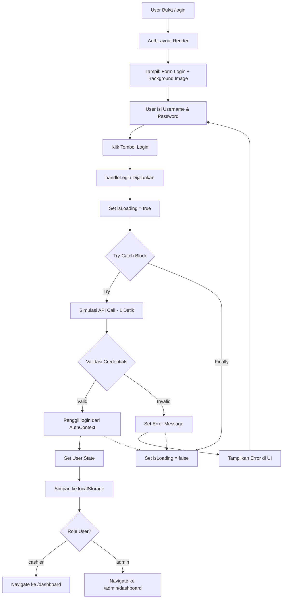
```mermaid
flowchart TD
    A[User Buka /login] --> B[AuthLayout Render]
    B --> C[Tampil: Form Login + Background Image]
    C --> D[User Isi Username & Password]
    D --> E[Klik Tombol Login]
    E --> F[handleLogin Dijalankan]
    F --> G[Set isLoading = true]
    G --> H{Try-Catch Block}

    H -->|Try| I[Simulasi API Call - 1 Detik]
    I --> J{Validasi Credentials}

    J -->|Valid| K[Panggil login dari AuthContext]
    K --> L[Set User State]
    L --> M[Simpan ke localStorage]
    M --> N{Role User?}

    N -->|cashier| O[Navigate ke /dashboard]
    N -->|admin| P[Navigate ke /admin/dashboard]

    J -->|Invalid| Q[Set Error Message]
    Q --> R[Tampilkan Error di UI]
    R --> D

    H -->|Finally| S[Set isLoading = false]

    K -.-> S
    Q -.-> S
```

### 2.2 Flow Register

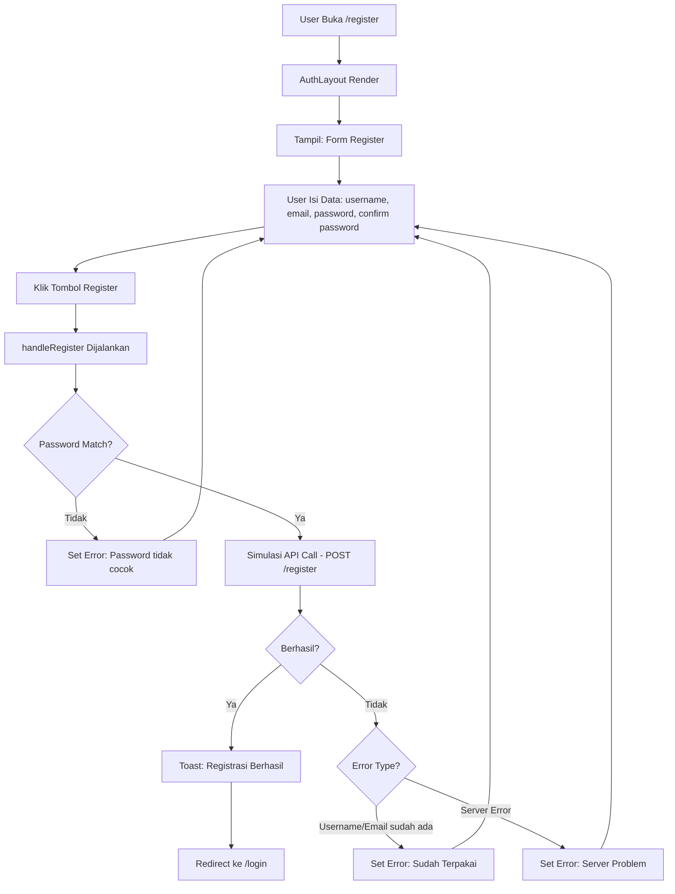
```mermaid
flowchart TD
    A[User Buka /register] --> B[AuthLayout Render]
    B --> C[Tampil: Form Register]
    C --> D[User Isi Data: username, email, password, confirm password]
    D --> E[Klik Tombol Register]
    E --> F[handleRegister Dijalankan]
    F --> G{Password Match?}

    G -->|Tidak| H[Set Error: Password tidak cocok]
    H --> D

    G -->|Ya| I[Simulasi API Call - POST /register]
    I --> J{Berhasil?}

    J -->|Ya| K[Toast: Registrasi Berhasil]
    K --> L[Redirect ke /login]

    J -->|Tidak| M{Error Type?}
    M -->|Username/Email sudah ada| N[Set Error: Sudah Terpakai]
    M -->|Server Error| O[Set Error: Server Problem]
    N --> D
    O --> D
```

### 2.3 Flow Reset Password (2 Step)

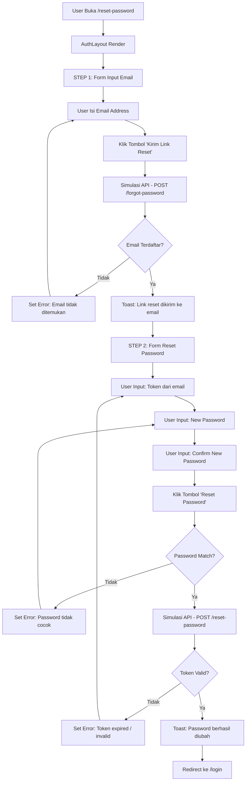
```mermaid
flowchart TD
    A[User Buka /reset-password] --> B[AuthLayout Render]
    B --> C[STEP 1: Form Input Email]
    C --> D[User Isi Email Address]
    D --> E[Klik Tombol 'Kirim Link Reset']
    E --> F[Simulasi API - POST /forgot-password]
    F --> G{Email Terdaftar?}

    G -->|Tidak| H[Set Error: Email tidak ditemukan]
    H --> D

    G -->|Ya| I[Toast: Link reset dikirim ke email]
    I --> J[STEP 2: Form Reset Password]

    J --> K[User Input: Token dari email]
    K --> L[User Input: New Password]
    L --> M[User Input: Confirm New Password]
    M --> N[Klik Tombol 'Reset Password']
    N --> O{Password Match?}

    O -->|Tidak| P[Set Error: Password tidak cocok]
    P --> L

    O -->|Ya| Q[Simulasi API - POST /reset-password]
    Q --> R{Token Valid?}

    R -->|Tidak| S[Set Error: Token expired / invalid]
    S --> K

    R -->|Ya| T[Toast: Password berhasil diubah]
    T --> U[Redirect ke /login]
```

---

## 3. Flow Dashboard Kasir

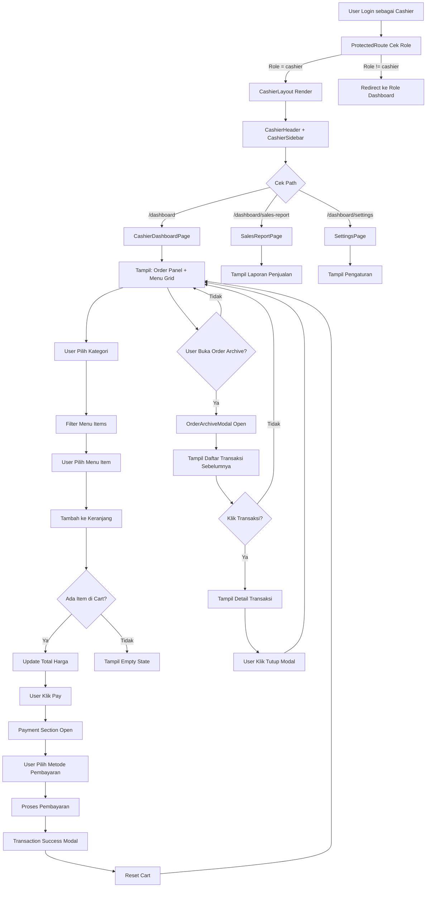
```mermaid
flowchart TD
    A[User Login sebagai Cashier] --> B[ProtectedRoute Cek Role]
    B -->|Role = cashier| C[CashierLayout Render]
    B -->|Role != cashier| D[Redirect ke Role Dashboard]

    C --> E[CashierHeader + CashierSidebar]
    E --> F{Cek Path}

    F -->|/dashboard| G[CashierDashboardPage]
    F -->|/dashboard/sales-report| H[SalesReportPage]
    F -->|/dashboard/settings| I[SettingsPage]

    G --> J[Tampil: Order Panel + Menu Grid]
    J --> K[User Pilih Kategori]
    K --> L[Filter Menu Items]
    L --> M[User Pilih Menu Item]
    M --> N[Tambah ke Keranjang]

    N --> O{Ada Item di Cart?}
    O -->|Ya| P[Update Total Harga]
    O -->|Tidak| Q[Tampil Empty State]

    P --> R[User Klik Pay]
    R --> S[Payment Section Open]
    S --> T[User Pilih Metode Pembayaran]
    T --> U[Proses Pembayaran]
    U --> V[Transaction Success Modal]
    V --> W[Reset Cart]
    W --> J

    J --> X{User Buka Order Archive?}
    X -->|Ya| Y[OrderArchiveModal Open]
    Y --> Z[Tampil Daftar Transaksi Sebelumnya]
    Z --> AA{Klik Transaksi?}
    AA -->|Ya| AB[Tampil Detail Transaksi]
    AB --> AC[User Klik Tutup Modal]
    AC --> J
    AA -->|Tidak| J
    X -->|Tidak| J

    H --> AD[Tampil Laporan Penjualan]
    I --> AE[Tampil Pengaturan]
```

### 3.1 Komponen Dashboard Kasir

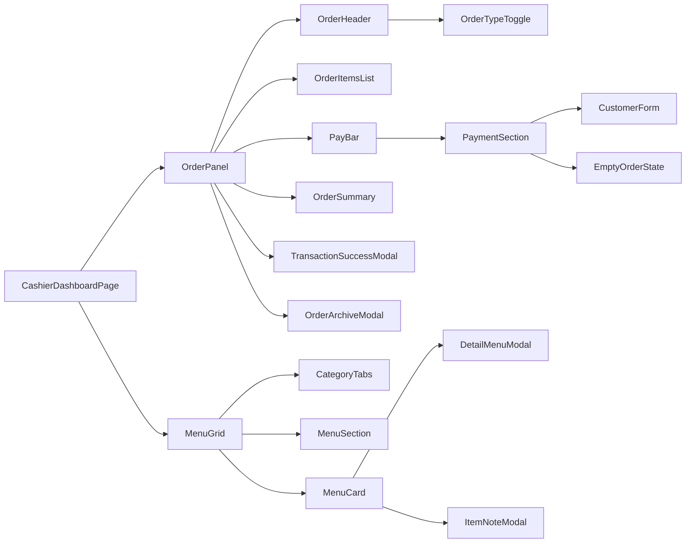
```mermaid
flowchart LR
    A[CashierDashboardPage] --> B[OrderPanel]
    A --> C[MenuGrid]

    B --> D[OrderHeader]
    B --> E[OrderItemsList]
    B --> F[PayBar]
    B --> G[OrderSummary]

    D --> H[OrderTypeToggle]

    C --> I[CategoryTabs]
    C --> J[MenuSection]
    C --> K[MenuCard]

    K --> L[DetailMenuModal]
    K --> M[ItemNoteModal]

    F --> N[PaymentSection]
    N --> O[CustomerForm]
    N --> P[EmptyOrderState]

    B --> Q[TransactionSuccessModal]
    B --> R[OrderArchiveModal]
```

---

## 4. Flow Dashboard Admin

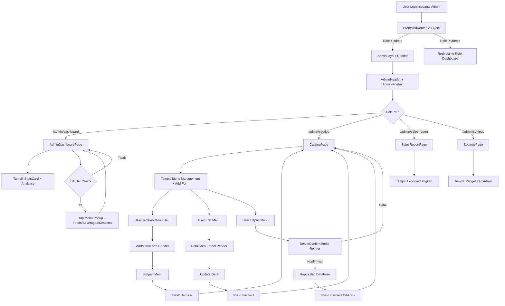
```mermaid
flowchart TD
    A[User Login sebagai Admin] --> B[ProtectedRoute Cek Role]
    B -->|Role = admin| C[AdminLayout Render]
    B -->|Role != admin| D[Redirect ke Role Dashboard]

    C --> E[AdminHeader + AdminSidebar]
    E --> F{Cek Path}

    F -->|/admin/dashboard| G[AdminDashboardPage]
    F -->|/admin/catalog| H[CatalogPage]
    F -->|/admin/sales-report| I[SalesReportPage]
    F -->|/admin/settings| J[SettingsPage]

    G --> K[Tampil: StatsCard + Analytics]
    H --> L[Tampil: Menu Management + Add Form]
    I --> M[Tampil: Laporan Lengkap]
    J --> N[Tampil: Pengaturan Admin]

    L --> O[User Tambah Menu Baru]
    O --> P[AddMenuForm Render]
    P --> Q[Simpan Menu]
    Q --> R[Toast: Berhasil]
    R --> H

    L --> S[User Edit Menu]
    S --> T[DetailMenuPanel Render]
    T --> U[Update Data]
    U --> V[Toast: Berhasil]
    V --> H

    L --> W[User Hapus Menu]
    W --> X[DeleteConfirmModal Render]
    X -->|Konfirmasi| Y[Hapus dari Database]
    X -->|Batal| H
    Y --> Z[Toast: Berhasil Dihapus]
    Z --> H

    G --> AA{Klik Bar Chart?}
    AA -->|Ya| AB[Top Menu Popup - Foods/Beverages/Desserts]
    AA -->|Tidak| G
    AB --> G
```

### 4.1 Komponen Dashboard Admin

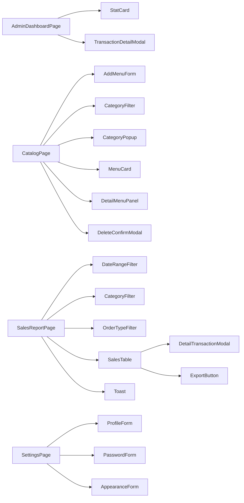
```mermaid
flowchart LR
    A1[AdminDashboardPage] --> B1[StatCard]
    A1 --> C1[TransactionDetailModal]

    D1[CatalogPage] --> E1[AddMenuForm]
    D1 --> F1[CategoryFilter]
    D1 --> G1[CategoryPopup]
    D1 --> H1[MenuCard]
    D1 --> I1[DetailMenuPanel]
    D1 --> J1[DeleteConfirmModal]

    K1[SalesReportPage] --> L1[DateRangeFilter]
    K1 --> M1[CategoryFilter]
    K1 --> N1[OrderTypeFilter]
    K1 --> O1[SalesTable]
    O1 --> P1[DetailTransactionModal]
    O1 --> Q1[ExportButton]
    K1 --> R1[Toast]

    S1[SettingsPage] --> T1[ProfileForm]
    S1 --> U1[PasswordForm]
    S1 --> V1[AppearanceForm]
```

---

## 5. Flow ProtectedRoute

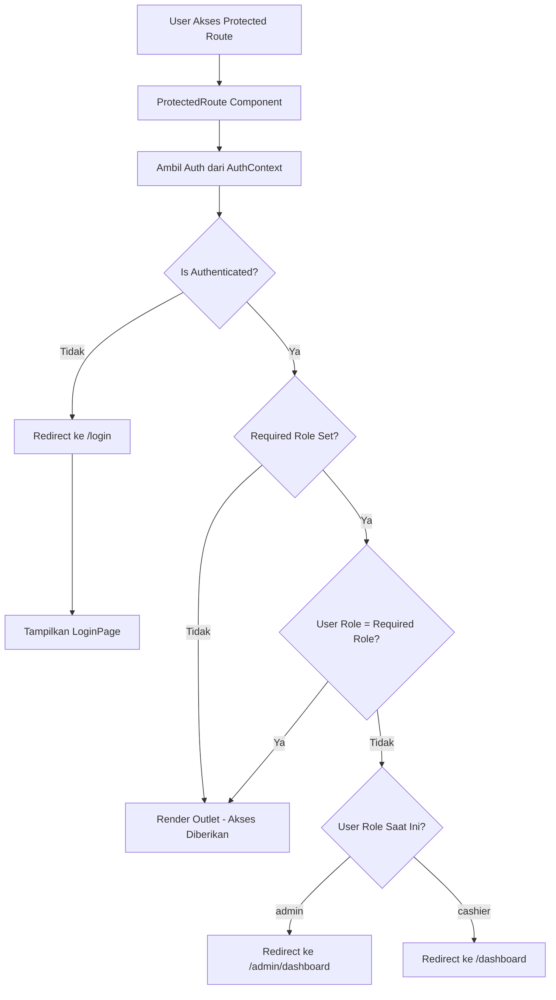
```mermaid
flowchart TD
    A[User Akses Protected Route] --> B[ProtectedRoute Component]
    B --> C[Ambil Auth dari AuthContext]
    C --> D{Is Authenticated?}

    D -->|Tidak| E[Redirect ke /login]
    E --> F[Tampilkan LoginPage]

    D -->|Ya| G{Required Role Set?}
    G -->|Tidak| H[Render Outlet - Akses Diberikan]

    G -->|Ya| I{User Role = Required Role?}
    I -->|Ya| H

    I -->|Tidak| J{User Role Saat Ini?}
    J -->|admin| K[Redirect ke /admin/dashboard]
    J -->|cashier| L[Redirect ke /dashboard]
```

---

## 6. Flow AuthContext

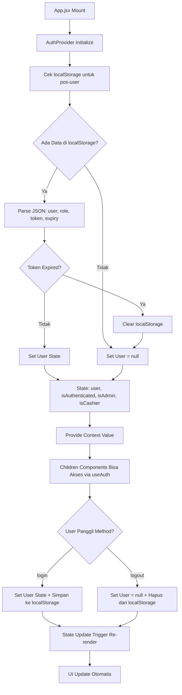
```mermaid
flowchart TD
    A[App.jsx Mount] --> B[AuthProvider Initialize]
    B --> C[Cek localStorage untuk pos-user]
    C --> D{Ada Data di localStorage?}

    D -->|Ya| E[Parse JSON: user, role, token, expiry]
    D -->|Tidak| F[Set User = null]

    E --> G{Token Expired?}
    G -->|Ya| H[Clear localStorage]
    H --> F
    G -->|Tidak| I[Set User State]
    I --> J[State: user, isAuthenticated, isAdmin, isCashier]

    F --> J

    J --> K[Provide Context Value]
    K --> L[Children Components Bisa Akses via useAuth]

    L --> M{User Panggil Method?}

    M -->|login| N[Set User State + Simpan ke localStorage]
    M -->|logout| O[Set User = null + Hapus dari localStorage]

    N --> P[State Update Trigger Re-render]
    O --> P
    P --> Q[UI Update Otomatis]
```

---

## 7. Flow Lengkap dari Awal sampai Akhir

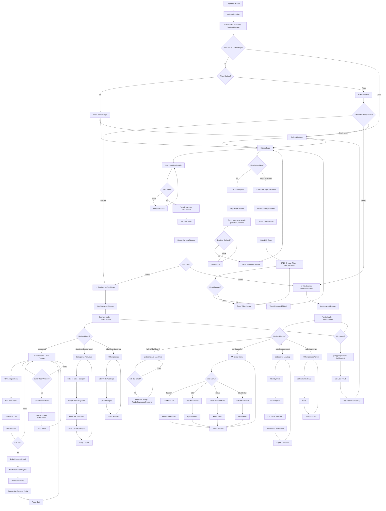
```mermaid
flowchart TD
    A[🚀 Aplikasi Dibuka] --> B[main.jsx Running]
    B --> C[AuthProvider Inisialisasi - Cek localStorage]
    C --> D{Ada User di localStorage?}
    D -->|Ya| E{Token Expired?}
    E -->|Ya| F[Clear localStorage]
    F --> G[Redirect ke /login]
    E -->|Tidak| H[Set User State]
    D -->|Tidak| G
    H --> I{Auto-redirect sesuai Role}
    I -->|cashier| J[👉 Redirect ke /dashboard]
    I -->|admin| K[👉 Redirect ke /admin/dashboard]

    I -->|Belum Login| G

    G --> L[🔐 LoginPage]
    L --> M[User Input Credentials]
    M --> N{Valid Login?}

    N -->|Tidak| O[Tampilkan Error]
    O --> M

    N -->|Ya| P[Panggil login dari AuthContext]
    P --> Q[Set User State]
    Q --> R[Simpan ke localStorage]
    R --> S{Role User?}

    S -->|cashier| J
    S -->|admin| K

    J --> T[CashierLayout Render]
    T --> U[CashierHeader + CashierSidebar]
    U --> V{Navigasi Kasir?}

    V -->|/dashboard| W[📊 Dashboard - Buat Pesanan]
    V -->|/dashboard/sales-report| X[📈 Laporan Penjualan]
    V -->|/dashboard/settings| Y[⚙️ Pengaturan]

    W --> Z[Pilih Kategori Menu]
    Z --> AA[Pilih Item Menu]
    AA --> AB[Tambah ke Cart]
    AB --> AC[Update Total]
    AC --> AD{Klik Pay?}

    AD -->|Tidak| W
    AD -->|Ya| AE[Buka Payment Panel]
    AE --> AF[Pilih Metode Pembayaran]
    AF --> AG[Proses Transaksi]
    AG --> AH[Transaction Success Modal]
    AH --> AI[Reset Cart]
    AI --> W

    W --> AJ{Buka Order Archive?}
    AJ -->|Ya| AK[OrderArchiveModal]
    AK --> AL[Lihat Transaksi Sebelumnya]
    AL --> AM[Tutup Modal]
    AM --> W
    AJ -->|Tidak| W

    Y --> AN[Edit Profile / Settings]
    AN --> AO[Save Changes]
    AO --> AP[Toast: Berhasil]
    AP --> Y

    X --> AQ[Filter by Date / Category]
    AQ --> AR[Tampil Tabel Penjualan]
    AR --> AS[Klik Baris Transaksi]
    AS --> AT[Detail Transaksi Popup]
    AT --> AU[Tutup / Export]
    AU --> X

    K --> AV[AdminLayout Render]
    AV --> AW[AdminHeader + AdminSidebar]
    AW --> AX{Navigasi Admin?}

    AX -->|/admin/dashboard| AY[📊 Dashboard - Analytics]
    AX -->|/admin/catalog| AZ[🍽️ Kelola Menu]
    AX -->|/admin/sales-report| BA[📈 Laporan Lengkap]
    AX -->|/admin/settings| BB[⚙️ Pengaturan Admin]

    AY --> BC1{Klik Bar Chart?}
    BC1 -->|Ya| BD1[Top Menu Popup - Foods/Beverages/Desserts]
    BC1 -->|Tidak| AY
    BD1 --> AY

    AZ --> BE{Aksi Menu?}
    BE -->|Tambah| BF[AddMenuForm]
    BE -->|Edit| BG[DetailMenuPanel]
    BE -->|Hapus| BH[DeleteConfirmModal]
    BE -->|Lihat Detail| BI[DetailMenuPanel]

    BF --> BJ[Simpan Menu Baru]
    BG --> BK[Update Menu]
    BH --> BL[Hapus Menu]
    BI --> BM[Lihat Detail]

    BJ --> BN[Toast: Berhasil]
    BK --> BN
    BL --> BN
    BM --> BN

    BN --> AZ

    BA --> BO[Filter by Date]
    BO --> BP[Tabel Laporan]
    BP --> BQ[Klik Detail Transaksi]
    BQ --> BR[TransactionDetailModal]
    BR --> BS[Export CSV/PDF]
    BS --> BA

    BB --> BT[Edit Admin Settings]
    BT --> BU[Save]
    BU --> BV[Toast: Berhasil]
    BV --> BB

    F --> L
    G --> L

    L --> BW{User Butuh Akun?}
    BW -->|Ya| BX[📝 Klik Link Register]
    BX --> BY[RegisPage Render]
    BY --> BZ[Form: username, email, password, confirm]
    BZ --> CA{Register Berhasil?}
    CA -->|Ya| CB[Toast: Registrasi Sukses]
    CB --> L
    CA -->|Tidak| CC[Tampil Error]
    CC --> BZ
    BW -->|Lupa Password| CD[🔄 Klik Link Lupa Password]
    CD --> CE[ResetPassPage Render]
    CE --> CF[STEP 1: Input Email]
    CF --> CG[Kirim Link Reset]
    CG --> CH[STEP 2: Input Token + New Password]
    CH --> CI{Reset Berhasil?}
    CI -->|Ya| CJ[Toast: Password Diubah]
    CJ --> L
    CI -->|Tidak| CK[Error: Token Invalid]
    CK --> CH

    AW --> CL{Klik Logout?}
    U --> CL
    CL --> CM[panggil logout dari AuthContext]
    CM --> CN[Set User = null]
    CN --> CO[Hapus dari localStorage]
    CO --> G
```

## 8. Flow Sales Report (Cashier & Admin)

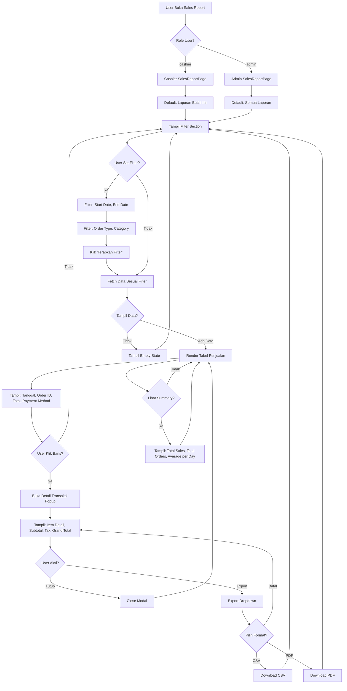
```mermaid
flowchart TD
    A[User Buka Sales Report] --> B{Role User?}

    B -->|cashier| C[Cashier SalesReportPage]
    B -->|admin| D[Admin SalesReportPage]

    C --> E[Default: Laporan Bulan Ini]
    D --> F[Default: Semua Laporan]

    E --> G[Tampil Filter Section]
    F --> G

    G --> H{User Set Filter?}
    H -->|Ya| I[Filter: Start Date, End Date]
    I --> J[Filter: Order Type, Category]
    J --> K[Klik 'Terapkan Filter']
    K --> L[Fetch Data Sesuai Filter]

    H -->|Tidak| L

    L --> M{Tampil Data?}
    M -->|Ada Data| N[Render Tabel Penjualan]
    M -->|Tidak| O[Tampil Empty State]
    O --> G

    N --> P[Tampil: Tanggal, Order ID, Total, Payment Method]
    P --> Q{User Klik Baris?}

    Q -->|Ya| R[Buka Detail Transaksi Popup]
    R --> S[Tampil: Item Detail, Subtotal, Tax, Grand Total]
    S --> T{User Aksi?}

    T -->|Tutup| U[Close Modal]
    T -->|Export| V[Export Dropdown]
    V --> W{Pilih Format?}

    W -->|CSV| X[Download CSV]
    W -->|PDF| Y[Download PDF]
    W -->|Batal| S

    U --> N
    X --> G
    Y --> G
    Q -->|Tidak| G

    N --> Z{Lihat Summary?}
    Z -->|Ya| AA[Tampil: Total Sales, Total Orders, Average per Day]
    AA --> N
    Z -->|Tidak| N
```

---

## 9. Flow Settings (Cashier & Admin)

### 9.1 Cashier Settings

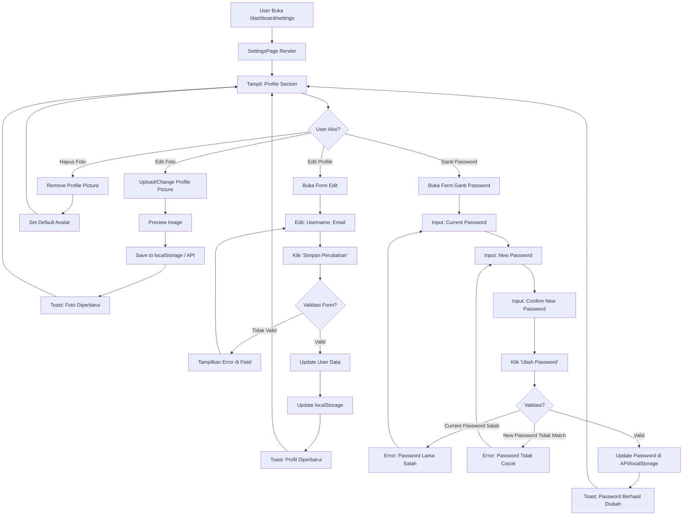
```mermaid
flowchart TD
    A[User Buka /dashboard/settings] --> B[SettingsPage Render]
    B --> C[Tampil: Profile Section]

    C --> D{User Aksi?}

    D -->|Edit Foto| E[Upload/Change Profile Picture]
    E --> F[Preview Image]
    F --> G[Save to localStorage / API]
    G --> H[Toast: Foto Diperbarui]
    H --> C

    D -->|Hapus Foto| I[Remove Profile Picture]
    I --> J[Set Default Avatar]
    J --> C

    D -->|Edit Profile| K[Buka Form Edit]
    K --> L[Edit: Username, Email]
    L --> M[Klik 'Simpan Perubahan']
    M --> N{Validasi Form?}

    N -->|Tidak Valid| O[Tampilkan Error di Field]
    O --> L

    N -->|Valid| P[Update User Data]
    P --> Q[Update localStorage]
    Q --> R[Toast: Profil Diperbarui]
    R --> C

    D -->|Ganti Password| S[Buka Form Ganti Password]
    S --> T[Input: Current Password]
    T --> U[Input: New Password]
    U --> V[Input: Confirm New Password]
    V --> W[Klik 'Ubah Password']
    W --> X{Validasi?}

    X -->|Current Password Salah| Y[Error: Password Lama Salah]
    Y --> T

    X -->|New Password Tidak Match| Z[Error: Password Tidak Cocok]
    Z --> U

    X -->|Valid| AA[Update Password di API/localStorage]
    AA --> AB[Toast: Password Berhasil Diubah]
    AB --> C
```

### 9.2 Admin Settings

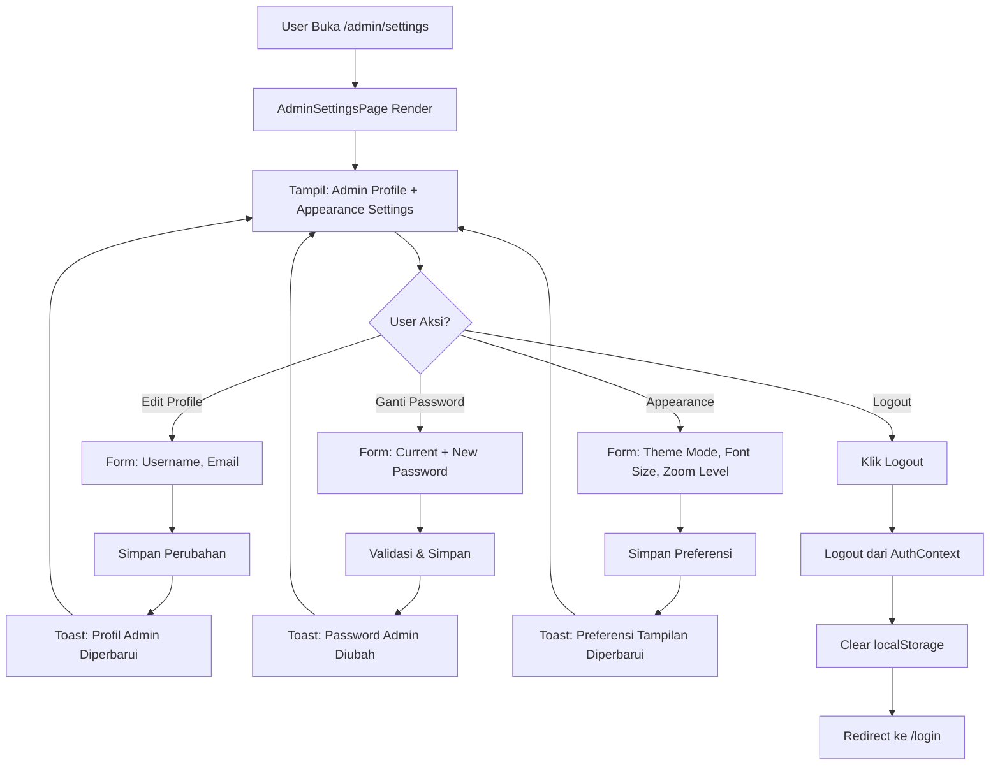
```mermaid
flowchart TD
    A[User Buka /admin/settings] --> B[AdminSettingsPage Render]
    B --> C[Tampil: Admin Profile + Appearance Settings]

    C --> D{User Aksi?}

    D -->|Edit Profile| E[Form: Username, Email]
    E --> F[Simpan Perubahan]
    F --> G[Toast: Profil Admin Diperbarui]
    G --> C

    D -->|Ganti Password| H[Form: Current + New Password]
    H --> I[Validasi & Simpan]
    I --> J[Toast: Password Admin Diubah]
    J --> C

    D -->|Appearance| K[Form: Theme Mode, Font Size, Zoom Level]
    K --> L[Simpan Preferensi]
    L --> M[Toast: Preferensi Tampilan Diperbarui]
    M --> C

    D -->|Logout| N[Klik Logout]
    N --> O[Logout dari AuthContext]
    O --> P[Clear localStorage]
    P --> Q[Redirect ke /login]
```

---

## 10. Flow Logout

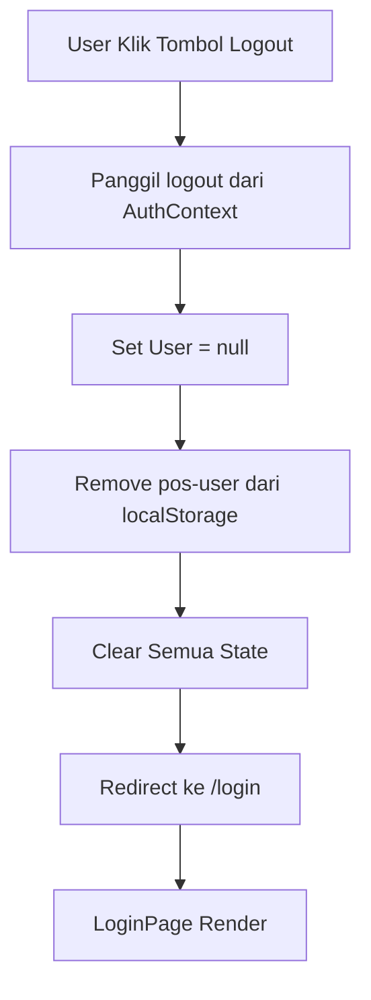
```mermaid
flowchart TD
    A[User Klik Tombol Logout] --> D[Panggil logout dari AuthContext]

    D --> E[Set User = null]
    E --> F[Remove pos-user dari localStorage]
    F --> G[Clear Semua State]
    G --> H[Redirect ke /login]
    H --> I[LoginPage Render]
```

---

## 11. Flow Error Handling Global

### 11.1 404 Not Found

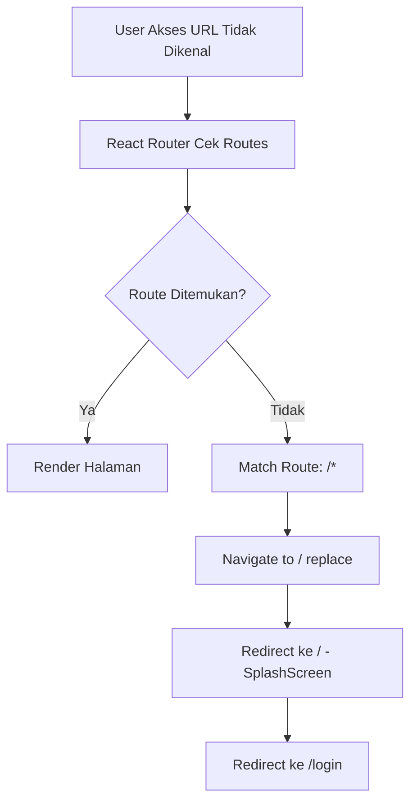
```mermaid
flowchart TD
    A[User Akses URL Tidak Dikenal] --> B[React Router Cek Routes]
    B --> C{Route Ditemukan?}
    C -->|Ya| D[Render Halaman]
    C -->|Tidak| E[Match Route: /*]
    E --> F[Navigate to / replace]
    F --> G[Redirect ke / - SplashScreen]
    G --> H[Redirect ke /login]
```

### 11.2 Unauthorized Access

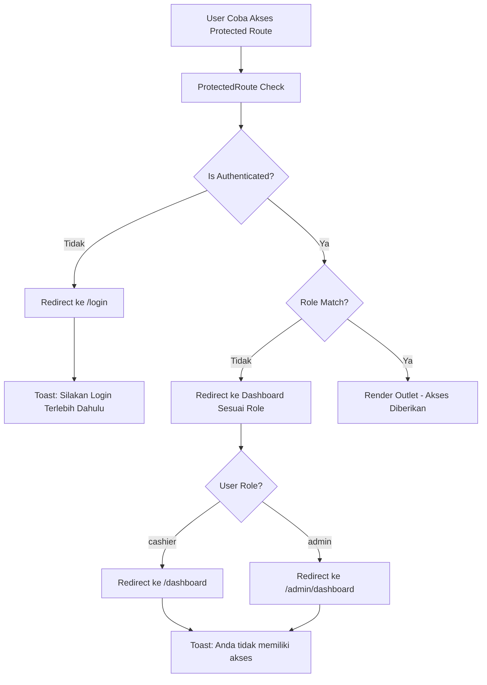
```mermaid
flowchart TD
    A[User Coba Akses Protected Route] --> B[ProtectedRoute Check]
    B --> C{Is Authenticated?}

    C -->|Tidak| D[Redirect ke /login]
    D --> E[Toast: Silakan Login Terlebih Dahulu]

    C -->|Ya| F{Role Match?}
    F -->|Tidak| G[Redirect ke Dashboard Sesuai Role]
    G --> H{User Role?}

    H -->|cashier| I[Redirect ke /dashboard]
    H -->|admin| J[Redirect ke /admin/dashboard]
    I --> K[Toast: Anda tidak memiliki akses]
    J --> K

    F -->|Ya| L[Render Outlet - Akses Diberikan]
```

### 11.3 Token Expired Saat Sudah Login

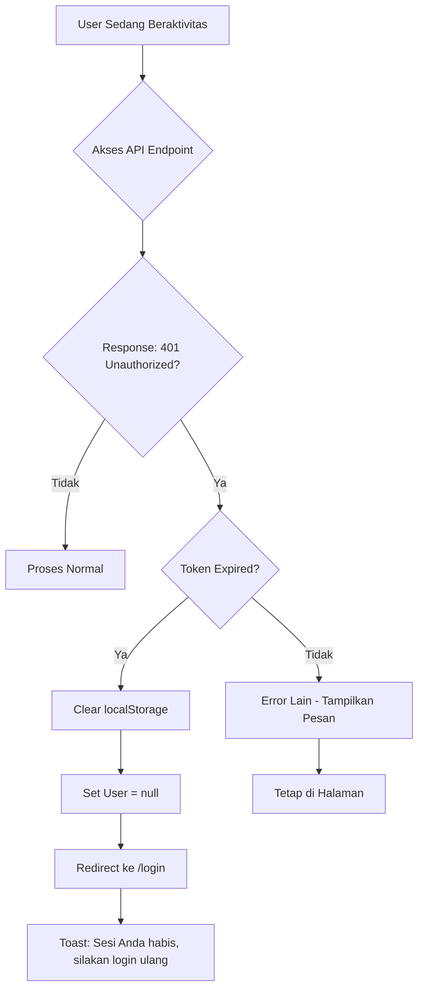
```mermaid
flowchart TD
    A[User Sedang Beraktivitas] --> B{Akses API Endpoint}
    B --> C{Response: 401 Unauthorized?}

    C -->|Tidak| D[Proses Normal]
    C -->|Ya| E{Token Expired?}

    E -->|Ya| F[Clear localStorage]
    F --> G[Set User = null]
    G --> H[Redirect ke /login]
    H --> I[Toast: Sesi Anda habis, silakan login ulang]

    E -->|Tidak| J[Error Lain - Tampilkan Pesan]
    J --> K[Tetap di Halaman]
```

### 11.4 Network Error

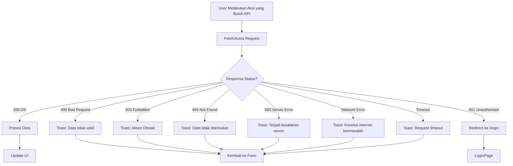
```mermaid
flowchart TD
    A[User Melakukan Aksi yang Butuh API] --> B[Fetch/Axios Request]
    B --> C{Response Status?}

    C -->|200 OK| D[Proses Data]
    C -->|400 Bad Request| E[Toast: Data tidak valid]
    C -->|401 Unauthorized| F[Redirect ke /login]
    C -->|403 Forbidden| G[Toast: Akses Ditolak]
    C -->|404 Not Found| H[Toast: Data tidak ditemukan]
    C -->|500 Server Error| I[Toast: Terjadi kesalahan server]
    C -->|Network Error| J[Toast: Koneksi internet bermasalah]
    C -->|Timeout| K[Toast: Request timeout]

    E --> L[Kembali ke Form]
    G --> L
    H --> L
    I --> L
    J --> L
    K --> L
    F --> M[LoginPage]
    D --> N[Update UI]
```

---

## 12. 🗺️ Peta Interaksi User per Halaman

### 👤 Kasir (Cashier)

```
┌─────────────────────────────────────────────────────────────┐
│                    DASHBOARD KASIR                           │
├─────────────────────────────────────────────────────────────┤
│                                                              │
│  ┌──────────────┐          ┌──────────────────────────────┐ │
│  │              │          │                              │ │
│  │  CATEGORY    │          │       MENU GRID              │ │
│  │  TABS        │   ────▶  │   ┌────┐  ┌────┐  ┌────┐   │ │
│  │              │          │   │ ☕ │  │ 🍔 │  │ 🍕 │   │ │
│  │  - All       │          │   └────┘  └────┘  └────┘   │ │
│  │  - Drinks    │          │                              │ │
│  │  - Food      │          │  Klik Item ▶ Tambah ke Cart  │ │
│  │  - Snacks    │          │                              │ │
│  │              │          │  Detail Modal:               │ │
│  │              │          │  - Note per Item             │ │
│  │              │          │  - Qty Adjustment            │ │
│  │              │          │  - Special Instructions      │ │
│  └──────────────┘          └──────────────────────────────┘ │
│                                                              │
│  ┌──────────────────────────────────────────────────────┐   │
│  │                  ORDER PANEL                         │   │
│  │                                                      │   │
│  │  Order Type: Dine In | Take Away               │   │
│  │                                                      │   │
│  │  ┌──────────────────────────────────────────────┐   │   │
│  │  │ Cart Items:                                  │   │   │
│  │  │ ☕ Kopi Susu x2          Rp 30.000           │   │   │
│  │  │ 🍔 Burger Keju x1        Rp 45.000           │   │   │
│  │  │                              ──────────────  │   │   │
│  │  │                              TOTAL: Rp 75K   │   │   │
│  │  └──────────────────────────────────────────────┘   │   │
│  │                                                      │   │
│  │  [ PAY ]                                             │   │
│  └──────────────────────────────────────────────────────┘   │
│                                                              │
└─────────────────────────────────────────────────────────────┘
```

### 👨‍💼 Admin

```
┌─────────────────────────────────────────────────────────────┐
│                    DASHBOARD ADMIN                           │
├─────────────────────────────────────────────────────────────┤
│                                                              │
│  ┌────────────┐  ┌────────────┐  ┌────────────┐            │
│  │  Today     │  │  This      │  │  Total     │            │
│  │  Sales     │  │  Week      │  │  Orders    │            │
│  │  Rp 2.5M   │  │  Rp 15M    │  │  150       │            │
│  └────────────┘  └────────────┘  └────────────┘            │
│                                                              │
│  ┌──────────────────────────────────────────────────────┐   │
│  │                   SIDEBAR NAV                        │   │
│  │                                                      │   │
│  │  📊 Dashboard        (active)                        │   │
│  │  🍽️ Catalog                                          │   │
│  │  📈 Sales Report                                      │   │
│  │  ⚙️ Settings                                          │   │
│  │                                                      │   │
│  └──────────────────────────────────────────────────────┘   │
│                                                              │
│  ┌──────────────────────────────────────────────────────┐   │
│  │              CATALOG (jika dipilih)                  │   │
│  │                                                      │   │
│  │  [ + Add Menu ]  [ Filter by Category ]              │   │
│  │                                                      │   │
│  │  ┌──────┐ ┌──────┐ ┌──────┐ ┌──────┐               │   │
│  │  │ ☕   │ │ 🍔   │ │ 🍕   │ │ 🥤   │               │   │
│  │  │ Edit │ │ Edit │ │ Edit │ │ Edit │               │   │
│  │  │ Del  │ │ Del  │ │ Del  │ │ Del  │               │   │
│  │  └──────┘ └──────┘ └──────┘ └──────┘               │   │
│  │                                                      │   │
│  └──────────────────────────────────────────────────────┘   │
│                                                              │
└─────────────────────────────────────────────────────────────┘
```

---

## 13. 🔐 State Management Flow

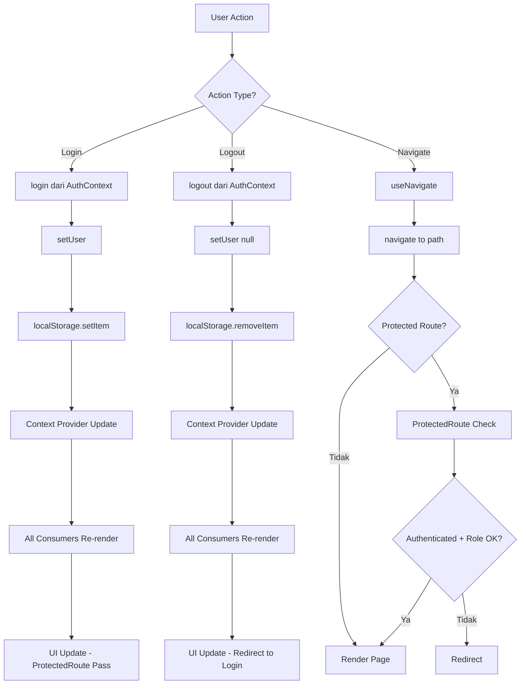
```mermaid
flowchart TD
    A[User Action] --> B{Action Type?}

    B -->|Login| C[login dari AuthContext]
    B -->|Logout| D[logout dari AuthContext]
    B -->|Navigate| E[useNavigate]

    C --> F[setUser]
    F --> G[localStorage.setItem]
    G --> H[Context Provider Update]
    H --> I[All Consumers Re-render]
    I --> J[UI Update - ProtectedRoute Pass]

    D --> K[setUser null]
    K --> L[localStorage.removeItem]
    L --> M[Context Provider Update]
    M --> N[All Consumers Re-render]
    N --> O[UI Update - Redirect to Login]

    E --> P[navigate to path]
    P --> Q{Protected Route?}
    Q -->|Ya| R[ProtectedRoute Check]
    Q -->|Tidak| S[Render Page]

    R --> T{Authenticated + Role OK?}
    T -->|Ya| S
    T -->|Tidak| U[Redirect]
```

---

## 14. 📊 Komponen Hierarki Lengkap

### Cashier Layout Components

```
CashierLayout
├── CashierHeader
│   ├── User Info
│   └── Logout Button
├── CashierSidebar
│   └── Navigation Links
└── Main Content (Outlet)
    ├── CashierDashboardPage
    │   ├── OrderPanel
    │   │   ├── OrderHeader
    │   │   │   └── OrderTypeToggle
    │   │   ├── OrderItemsList
    │   │   ├── OrderSummary
    │   │   └── PayBar
    │   ├── CategoryTabs
    │   ├── MenuSection
    │   │   └── MenuGrid
    │   │       └── MenuCard
    │   │           ├── DetailMenuModal
    │   │           └── ItemNoteModal
    │   ├── PaymentSection
    │   │   ├── CustomerForm
    │   │   └── EmptyOrderState
    │   ├── TransactionSuccessModal
    │   └── OrderArchiveModal
    ├── SalesReportPage
    └── SettingsPage
```

### Admin Layout Components

```
AdminLayout
├── AdminHeader
│   ├── User Info
│   └── Logout Button
├── AdminSidebar
│   └── Navigation Links
└── Main Content (Outlet)
    ├── AdminDashboardPage
    │   ├── StatCard
    │   └── TransactionDetailModal
    ├── CatalogPage
    │   ├── AddMenuForm
    │   ├── CategoryFilter
    │   ├── CategoryPopup
    │   ├── MenuCard
    │   ├── DetailMenuPanel
    │   └── DeleteConfirmModal
    ├── SalesReportPage
    └── SettingsPage
```

---

## 🚀 Tips Membaca Flowchart

1. **Mulai dari atas** → `Aplikasi Dibuka` adalah titik awal
2. **Ikuti panah** → Setiap panah menunjukkan alur berikutnya
3. **Decision boxes (diamond)** → Ada kondisi yang menentukan jalur
4. **Boxes (rectangle)** → Komponen atau action yang dijalankan
5. **Lingkaran** → State atau kondisi

---

**Dibuat untuk dokumentasi aplikasi POS Frontend** 📝
