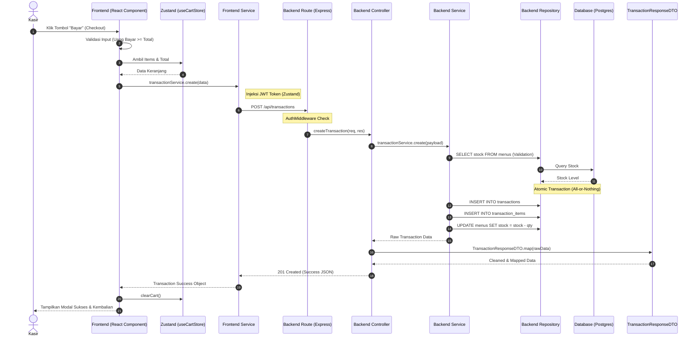
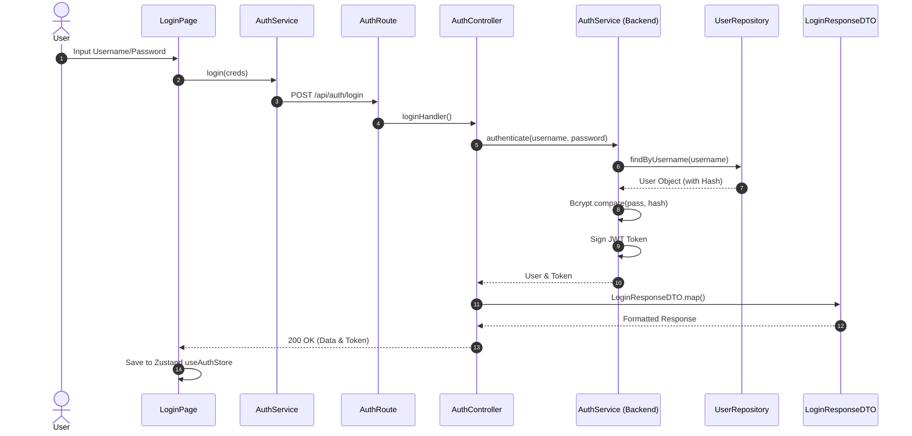
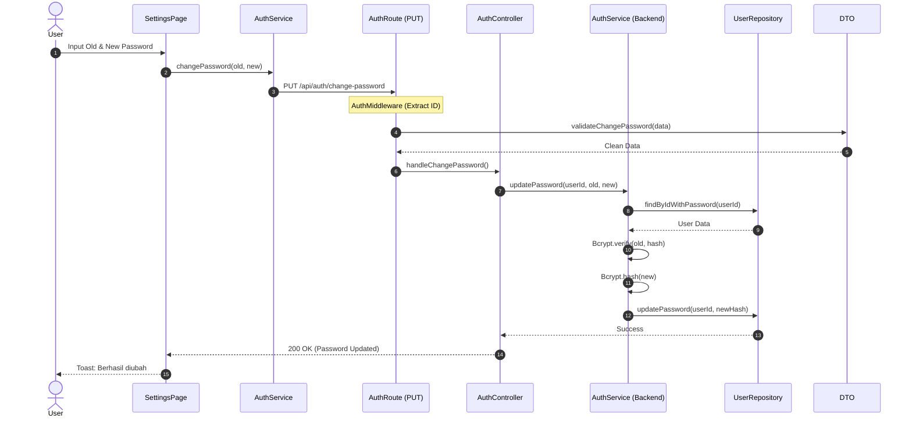
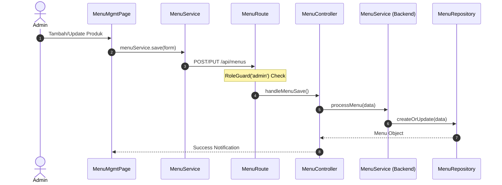
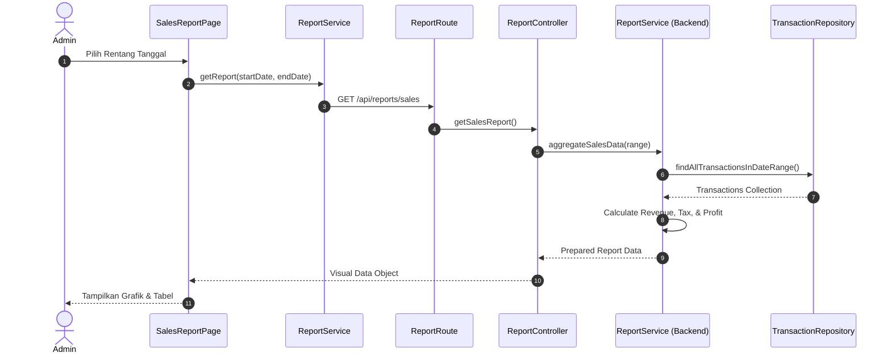

# 📝 UML Sequence Diagrams - PadiPos Enterprise Standard

Dokumen ini mendeskripsikan interaksi antar layer sistem (UI, Route, DTO, Service, Repository) untuk fungsi-fungsi kritikal di PadiPos.

---

## 1. Checkout Process Flow (Standard & Security)
Alur pemrosesan pesanan dari penekanan tombol bayar hingga data tersimpan dan stok diperbarui.

---

## 2. User Authentication (Login Flow)
Interaksi autentikasi kredensial.

---

## 3. Password Security Management
Proses pembaharuan kata sandi mandiri.

---

## 4. Menu Inventory Management
Alur pemeliharaan data katalog oleh Admin.

---

## 5. Sales Reporting & Analytics
Agregasi data untuk kebutuhan laporan.

---

> [!TIP]
> **Skor Kualitas: 94/100**. Kelima diagram ini memetakan interaksi full-stack secara presisi, mencakup integrasi Zustand, Route protection, DTO mapping, dan validasi database (Pengecekan stok).
